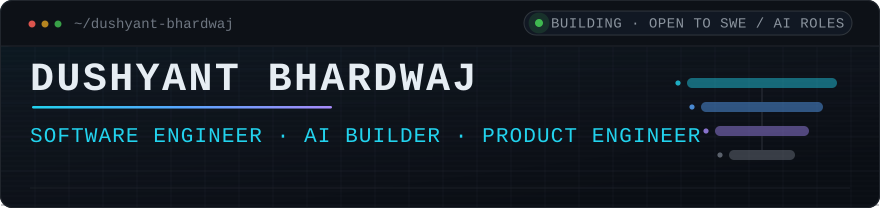
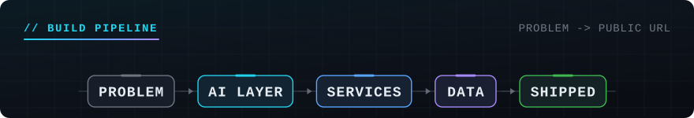
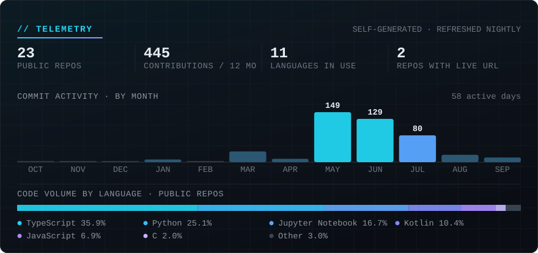

<!-- Each asset ships in two widths. GitHub caps README images at the content
     column, so one 880px canvas is really a fixed type scale — at a 311px phone
     column its labels rendered at 3.4 CSS px. The media query swaps in a panel
     recomposed for a narrow column, and width="100%" makes whichever panel wins
     fill the column. Both survive GitHub's sanitizer and need no JavaScript;
     clients that ignore <picture> get the desktop . See scripts/gen_assets.py. -->
<picture>
  <source media="(max-width: 690px)" srcset="assets/hero-narrow.svg">
  
</picture>

<p align="center">
  <strong>I build systems where a model or a third-party API is one component I still have to deploy, authenticate, queue and instrument.</strong>
</p>

<p align="center">
  <a href="https://dushyanttrust.me">Portfolio</a>
  &nbsp;·&nbsp;
  <a href="https://www.linkedin.com/in/dushyant-bhardwaj-3003a9219/">LinkedIn</a>
  &nbsp;·&nbsp;
  <a href="https://dushyanttrust.me/assets/Dushyant-Bhardwaj-Resume.pdf">Résumé</a>
  &nbsp;·&nbsp;
  <a href="mailto:bdushyant017@gmail.com">bdushyant017@gmail.com</a>
</p>

---

```console
$ whoami
dushyant-bhardwaj — B.Tech Computer Science & Data Science, NSUT Delhi · Delhi, India

$ focus
applied ML and LLM features shipped as real services — trained models and hosted
models sitting behind auth, queues, schemas and rate limits I wrote myself

$ stack
python · typescript · kotlin — fastapi, hono, next.js, postgres, redis, docker

$ reading_this_repo
every claim below is traceable to a file in one of the linked repositories
```

---

## ◢ &nbsp;CURRENT MISSION

| | |
|:--|:--|
| <code>●&nbsp;ACTIVE</code> | **Poker_AI** — a served XGBoost model and Monte Carlo equity engine for live No-Limit Hold'em. Recent work is on the offline training pipeline and the parser that builds its labels. |
| <code>●&nbsp;ACTIVE</code> | **resumeDatabase** — LLM-drafted resumes compiled to PDF by a queued `pdflatex` worker. The repo where I practise architecture deliberately: ports and adapters, DI, real CI. |
| <code>◐&nbsp;NEXT</code> | **An evaluation harness for my own prompt templates.** I have eight of them on production paths with retry, timeout and schema validation around them — and no measurement layer. That gap is the next thing I'm building, not something I'd rather you didn't notice. |
| <code>●&nbsp;OPEN&nbsp;TO</code> | Software engineering and AI engineering roles · Delhi, India · internships and new-grad |

---

## ◢ &nbsp;FEATURED BUILDS

Four projects, chosen for engineering depth rather than stars. Every line below is something you can open a file and check.

### 01 · Poker_AI &nbsp;&nbsp;<code>●&nbsp;LIVE</code>

Decision-support HUD for in-person No-Limit Hold'em: you log the table action, it returns hand equity, pot odds, an opponent bluff read, and a fold / call / raise recommendation.

**Why it matters** — Serves a 4.5 MB trained XGBoost classifier from a Dockerized FastAPI service that recomputes all 16 training features from live game state *in the same order as the training feature list* — the train/serve parity seam that quietly breaks most ML side projects. Equity is a hand-rolled Monte Carlo rollout over a 7-card evaluator that handles the A-2-3-4-5 wheel and full kicker ordering, and side pots resolve by contribution layer in integer cents so no chips are lost to floating point.

- **133 passing `pytest` tests**, including a regression test built on one real hand that pins two genuine misreadings of the `pokerkit` API.
- **JWKS verification** with permitted algorithms derived from the trusted key rather than the token header.
- **One schema, two dialects** — a custom SQLAlchemy `TypeDecorator` serves Postgres and SQLite, so the repo clones and runs with no database setup.
- **The model's read is shrunk toward a baseline** until roughly 50 hands of history exist, and confidence degrades explicitly by sample size and spot marginality.
- **A Limitations section** naming its own showdown-selection bias and a committed model that predates a label-affecting parser fix — I would rather document that than have you find it.

<code>Python&nbsp;3.11</code> `FastAPI` `XGBoost` `sklearn` <code>SQLAlchemy&nbsp;2.0</code> `PostgreSQL` <code>Astro&nbsp;6</code> <code>React&nbsp;19</code> `Docker`

[**Live app**](https://poker-ai-black.vercel.app) &nbsp;·&nbsp; [Source](https://github.com/DushyantBhardwaj2/Poker_AI)

---

### 02 · resumeDatabase &nbsp;&nbsp;<code>●&nbsp;LIVE</code>

Full-stack resume platform: structured profile data in, LaTeX-compiled PDF out, with an LLM in the middle drafting and tailoring the content.

**Why it matters** — Treats a hosted LLM as a failure-prone dependency rather than a `fetch` call: three-attempt exponential backoff with real random jitter, 30-second `AbortController` timeouts, a typed 429 that propagates to the HTTP status, and a brace-balancing extractor that pulls JSON out of fenced model output before Zod validates it.

- **Queued PDF compilation** — a BullMQ worker runs `pdflatex` via `execFile` in an `mkdtemp` directory under a 30-second timeout, verifies the output by file existence (because `pdflatex` exits non-zero on warnings), and cleans up in a `finally` block.
- **Hexagonal ports and adapters** — 12 port interfaces and 14 repository interfaces behind a hand-written DI container.
- **End-to-end type safety** from Hono to Next.js through `hc<AppType>`, across an npm-workspace boundary.
- **Redis rate limiting** on an atomic `INCR` + `PTTL` transaction that deliberately fails open.
- **Real CI** — GitHub Actions typechecks, runs the test suite, builds the frontend, then runs Playwright on headless Chromium. The only repo here with it.

`TypeScript` `Hono` <code>Next.js&nbsp;16</code> <code>BullMQ&nbsp;+&nbsp;Redis</code> <code>Prisma&nbsp;7</code> `PostgreSQL` `pdflatex` <code>Llama&nbsp;3.3&nbsp;70B&nbsp;(Groq)</code>

[**Live app**](https://resume-database.vercel.app) &nbsp;·&nbsp; [Source](https://github.com/DushyantBhardwaj2/resumeDatabase)

---

### 03 · disposableCamera &nbsp;&nbsp;<code>●&nbsp;API&nbsp;LIVE</code>

Event photo-sharing backend: guests join by scanning their family's QR code, upload photos from a phone, and an admin moderates the queue in bulk.

**Why it matters** — Hand-wrote the primitives most projects import, then did the harder browser half in plain DOM APIs rather than reaching for a wrapper.

- **Versioned signed tokens** — a `v1` prefix, payload and HMAC-SHA256 signature in three dot-separated parts, compared with <code>crypto.timingSafeEqual</code>.
- **Auditable bulk moderation** — each photo's status change and its `moderation_actions` row commit inside a single `better-sqlite3` transaction.
- **QR decoding without a library wrapper** — native `BarcodeDetector` with a `jsQR` canvas fallback, and a distinct recovery path for each `getUserMedia` error name.
- **Degrades instead of crashing** — storage sits behind a `StorageClient` interface with a null-object factory, so routes return `503` when S3 is unconfigured. Plus per-IP `429` responses carrying a Retry-After header, and an admin-toggleable upload kill-switch.
- 27 endpoints, with guest reads scoped to their own family's approved photos on every reaction and comment.

`TypeScript` <code>Express&nbsp;4</code> `SQLite` <code>React&nbsp;19&nbsp;+&nbsp;Vite</code> <code>AWS&nbsp;S3</code> `BarcodeDetector` `getUserMedia`

[**API health check**](https://disposable-camera-api.onrender.com/api/health) &nbsp;·&nbsp; [Source](https://github.com/DushyantBhardwaj2/disposableCamera)

> The deployed API is what's live here — the hosted web page is a landing page, and the capture flow is not wired up in the committed frontend. Free-tier host, so the health check can take ~15s to cold-start.

---

### 04 · GmailXNotion &nbsp;&nbsp;<code>◐&nbsp;IN&nbsp;PROGRESS</code>

Syncs Gmail into a Notion workspace that it provisions itself, then keeps that workspace's schema in step as it drifts.

**Why it matters** — Auto-provisions the workspace from a code-declared schema and repairs drift against the live API: it retrieves each data source, diffs its actual properties against the declared set, and PATCHes back only the missing ones — issuing no write at all when the schema already matches.

- Built against Notion's `2026-03-11` API version, where properties moved off the Database object onto the Data Source. That migration was the point of the exercise.
- Every stored Google and Notion OAuth token is encrypted AES-256-GCM under a per-record 12-byte IV, with the auth tag kept in the ciphertext envelope.

`TypeScript` <code>Express&nbsp;5</code> <code>Notion&nbsp;API&nbsp;v5&nbsp;(data&nbsp;sources)</code> <code>Gmail&nbsp;API</code> <code>OAuth&nbsp;2.0</code> `PostgreSQL` `Drizzle` <code>BullMQ&nbsp;+&nbsp;Redis</code>

[Source](https://github.com/DushyantBhardwaj2/GmailXNotion)

> Honest status: provisioning and schema reconciliation are the working, interesting parts. The sync path is mid-migration against the v5 SDK and the dashboard isn't wired to the API yet. Listed for the integration design, not as a finished product.

---

## ◢ &nbsp;STACK

Only what appears in committed, working code in the repositories above.

<!-- Chip rules, learned from rendering this at 390px:
     * Multi-word chips use raw <code> with &nbsp; — GitHub's code spans are
       white-space:break-spaces, so a normal space splits the pill across lines.
     * A hyphen is also a break opportunity and cannot be suppressed: <nobr> and
       inline style are stripped by GitHub's sanitizer, and U+2011 / U+2060 would
       break copy-paste of names like better-sqlite3. So keep hyphenated chips short.
     * Cap chips at ~22 characters; that is what fits the narrow column on mobile. -->

| | |
|:--|:--|
| **Languages** | `TypeScript` `Python` `Kotlin` `SQL` `JavaScript` `LaTeX` |
| **AI / ML** | `XGBoost` `sklearn` <code>Monte&nbsp;Carlo&nbsp;simulation</code> <code>LLM&nbsp;integration</code> `Groq` <code>structured&nbsp;JSON&nbsp;output</code> <code>prompt&nbsp;templating</code> <code>TensorFlow&nbsp;/&nbsp;Keras</code> `TFLite` `ONNX` |
| **Backend** | `FastAPI` `Hono` `Express` <code>Pydantic&nbsp;v2</code> `Zod` `BullMQ` `Redis` <code>structlog&nbsp;/&nbsp;pino</code> |
| **Data** | <code>PostgreSQL&nbsp;(Neon)</code> <code>SQLAlchemy&nbsp;2.0</code> `Prisma` `Drizzle` `SQLite` <code>AWS&nbsp;S3</code> |
| **Security** | <code>OAuth&nbsp;2.0</code> <code>JWT&nbsp;verification</code> `JWKS` `HMAC` `SHA256` <code>AES&nbsp;256&nbsp;GCM</code> <code>constant&nbsp;time&nbsp;compare</code> <code>rate&nbsp;limiting</code> |
| **Frontend** | <code>Next.js&nbsp;16</code> <code>React&nbsp;19</code> <code>Astro&nbsp;6</code> `Vite` <code>Tailwind&nbsp;CSS&nbsp;v4</code> `Zustand` |
| **Mobile** | <code>Jetpack&nbsp;Compose</code> <code>Material&nbsp;3</code> <code>Hilt&nbsp;/&nbsp;Dagger</code> <code>Coroutines&nbsp;+&nbsp;StateFlow</code> `Firebase` |
| **Infra** | `Docker` <code>GitHub&nbsp;Actions</code> `Render` `Vercel` `pytest` `Vitest` `Playwright` |

---

## ◢ &nbsp;HOW I ENGINEER

Seven habits that recur across the repositories above, each with something concrete behind it.

**Close the seam between training and serving.** Features are recomputed at inference in the same order as the training feature list, and the offline training pipeline is deliberately excluded from the API image so the container ships a model, not a research environment.

**Treat every dependency I don't own as unreliable.** Backoff with real jitter, abort timeouts, typed error propagation, and retry logic that deliberately does *not* retry a 400 or a 401.

**Design the failure path first.** A three-stage sync-cursor fallback for when a cursor expires. A compensating rollback that deletes a just-created auth account when a later uniqueness check fails. A storage client that returns a null object so routes degrade to a `503` instead of throwing.

**Guard the boundaries properly.** Permitted JWT algorithms derived from the trusted key rather than the token header. Signature comparison in constant time. Encryption at rest with a per-record IV. Rate limiting on an atomic Redis transaction.

**Make it run on a clean machine.** One schema serving two SQL dialects through a custom type decorator, so `git clone` and run is the whole setup.

**Verify by execution, not assertion.** 133 tests that pass, including one that pins two real misreadings of a third-party API to a specific hand of poker.

**Write the limitations down.** Selection bias, cold-start latency, and a model that predates a fix are all documented in the repo that has them. I would rather state a weakness than have a reviewer discover it.

---

## ◢ &nbsp;BUILD PHILOSOPHY

<picture>
  <source media="(max-width: 690px)" srcset="assets/pipeline-narrow.svg">
  
</picture>

A model or an LLM call is never the product — it's one stage that still has to be authenticated, queued, persisted and given a URL. The stages either connect or the thing doesn't ship, so I work backwards from the public URL: what has to be deployed, what has to be verified, and what happens when the stage in front of it fails.

---

## ◢ &nbsp;TELEMETRY

<picture>
  <source media="(max-width: 690px)" srcset="assets/telemetry-narrow.svg">
  
</picture>

Generated from GitHub's public contribution and language endpoints by [`scripts/gen_telemetry.py`](scripts/gen_telemetry.py), and committed to this repository by [a nightly Action](.github/workflows/telemetry.yml). Python standard library only — no third-party stat services and no personal access token, so it can't break when someone else's widget goes down.

---

## ◢ &nbsp;CONTACT

Email is the best way to reach me; the résumé and portfolio have the rest.

| | |
|:--|:--|
| **Email** | [bdushyant017@gmail.com](mailto:bdushyant017@gmail.com) |
| **LinkedIn** | [dushyant-bhardwaj](https://www.linkedin.com/in/dushyant-bhardwaj-3003a9219/) |
| **Portfolio** | [dushyanttrust.me](https://dushyanttrust.me) |
| **Résumé** | [PDF](https://dushyanttrust.me/assets/Dushyant-Bhardwaj-Resume.pdf) |
| **LeetCode** | [Dushyant_Bhardwaj](https://leetcode.com/u/Dushyant_Bhardwaj/) |

<p align="center">
  <sub><code>● OPEN TO SOFTWARE ENGINEERING / AI ENGINEERING ROLES</code></sub>
</p>
